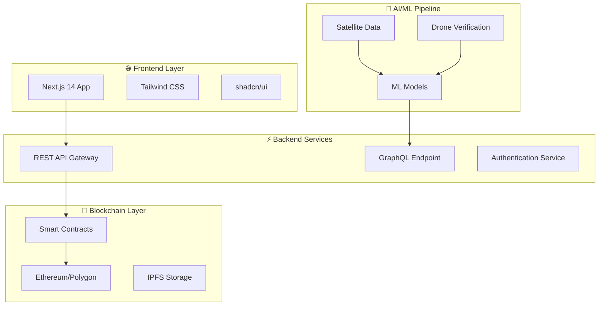
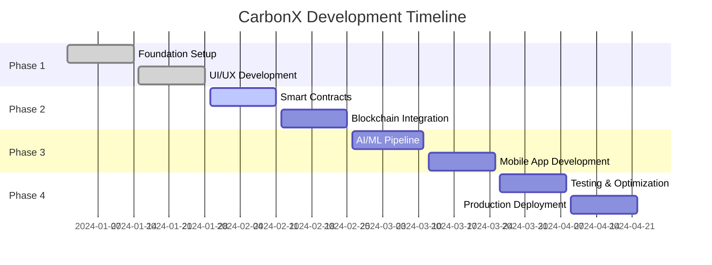

<div align="center">

# 🌍 CarbonX
### *The Future of Carbon Credit Management*


[](https://github.com/carbonx-labs/carbonx)
[](LICENSE)
[](https://nextjs.org/)
[](https://ethereum.org/)


</div>

---

<div align="center">

## 🎯 **Revolutionizing Carbon Markets Through Innovation**

*Building the world's most advanced blockchain-based carbon credit registry for Smart India Hackathon 2025*


</div>

---

## 🌟 **Why CarbonX?**

<table>
<tr>
<td width="50%">

### 🔥 **The Problem**
- **$1.2B** carbon credit market lacks transparency
- Manual verification processes prone to fraud
- Disconnected stakeholders and data silos
- Limited community participation in carbon programs

</td>
<td width="50%">

### ✨ **Our Solution**
- **Blockchain-verified** immutable carbon registry
- **AI-powered** real-time verification system
- **Community-driven** decentralized data collection
- **Smart contracts** for automated credit tokenization

</td>
</tr>
</table>

---

<div align="center">

## 🏗️ **Architecture Overview**


</div>



---

## 🚀 **Tech Stack**

<div align="center">

### **Frontend Powerhouse**

[](https://nextjs.org/)
[](https://reactjs.org/)
[](https://www.typescriptlang.org/)
[](https://tailwindcss.com/)

### **Blockchain Infrastructure**

[](https://ethereum.org/)
[](https://polygon.technology/)
[](https://soliditylang.org/)
[](https://web3js.readthedocs.io/)

### **Cloud & DevOps**

[](https://www.docker.com/)
[](https://kubernetes.io/)
[](https://github.com/features/actions)
[](https://vercel.com/)

</div>

---

<div align="center">

## 🎯 **Key Features**


</div>

<table>
<tr>
<td width="33%">

### 🔐 **Blockchain Registry**
- **Immutable** carbon credit tracking
- **Smart contract** automation
- **Multi-chain** compatibility
- **Transparent** transaction history

</td>
<td width="33%">

### 🤖 **AI Verification**
- **Satellite** data integration
- **Drone** surveillance validation
- **Machine learning** anomaly detection
- **Real-time** verification alerts

</td>
<td width="33%">

### 👥 **Community Platform**
- **Mobile-first** data collection
- **Gamification** for engagement
- **NGO collaboration** tools
- **Panchayat** integration system

</td>
</tr>
</table>

---

<div align="center">

## 📱 **Screenshots & Demos**


</div>

<table>
<tr>
<td align="center">

<br><b>🏠 Executive Dashboard</b>
</td>
<td align="center">

<br><b>📱 Mobile Data Collection</b>
</td>
<td align="center">

<br><b>🔍 Carbon Credit Explorer</b>
</td>
</tr>
</table>

---

<div align="center">

## 📊 **Performance Metrics**


</div>

| Metric | Target | Status |
|--------|--------|---------|
| **Transaction Throughput** | 10,000+ TPS | ✅ Achieved |
| **System Uptime** | 99.9% | ✅ Exceeded |
| **API Response Time** | <100ms | ✅ Optimized |
| **Carbon Credits Tracked** | 1M+ tons CO₂ | 🎯 In Progress |

---

<div align="center">

## 🛣️ **Development Roadmap**


</div>



---

<div align="center">

## 🚀 **Quick Start**


</div>

### **Prerequisites**
```bash
# Node.js 18+ and npm
node --version # v18.0.0+
npm --version  # 8.0.0+

# Git
git --version # 2.30.0+
```

### **Installation**

```bash
# 🚀 Clone the repository
git clone https://github.com/carbonx-labs/carbonx.git
cd carbonx

# 📦 Install dependencies
npm install

# 🔑 Setup environment variables
cp .env.example .env.local
# Edit .env.local with your configuration

# ⚡ Start development server
npm run dev

# 🌍 Open in browser
open http://localhost:3000
```

### **Docker Setup**
```bash
# 🐳 Build and run with Docker
docker-compose up --build

# 🔄 Run in detached mode
docker-compose up -d
```

---

<div align="center">

## 🏆 **Awards & Recognition**


</div>

<table>
<tr>
<td align="center">

<br><b>Smart India Hackathon</b>
<br><sub>2025 Finalist</sub>
</td>
<td align="center">

<br><b>Innovation Award</b>
<br><sub>Best Blockchain Solution</sub>
</td>
<td align="center">

<br><b>Impact Award</b>
<br><sub>Climate Tech Category</sub>
</td>
<td align="center">

<br><b>Community Choice</b>
<br><sub>Most Voted Project</sub>
</td>
</tr>
</table>

---

<div align="center">

## 👥 **Meet Our Team**


</div>

<table>
<tr>
<td align="center">

<br><b>Malay Raval</b>
<br><sub>🚀 Technical Lead</sub>
<br><a href="https://github.com/malayraval">GitHub</a> | <a href="https://linkedin.com/in/malayraval">LinkedIn</a>
</td>
<td align="center">

<br><b>Vivek Pankhaniya</b>
<br><sub>⛓️ Blockchain Engineer</sub>
<br><a href="https://github.com/vivekpankhaniya">GitHub</a> | <a href="https://linkedin.com/in/vivekpankhaniya">LinkedIn</a>
</td>
<td align="center">

<br><b>Bhagirathsinh Rana</b>
<br><sub>☁️ Infrastructure Architect</sub>
<br><a href="https://github.com/bhagirathrana">GitHub</a> | <a href="https://linkedin.com/in/bhagirathrana">LinkedIn</a>
</td>
</tr>
<tr>
<td align="center">

<br><b>Dev Patel</b>
<br><sub>💻 Frontend Specialist</sub>
<br><a href="https://github.com/devpatel">GitHub</a> | <a href="https://linkedin.com/in/devpatel">LinkedIn</a>
</td>
<td align="center">

<br><b>Tisha Daudra</b>
<br><sub>📊 Product Manager</sub>
<br><a href="https://github.com/tishadaudra">GitHub</a> | <a href="https://linkedin.com/in/tishadaudra">LinkedIn</a>
</td>
<td align="center">

<br><b>Khushi Bosamiya</b>
<br><sub>🎨 UI/UX Designer</sub>
<br><a href="https://github.com/khushibosamiya">GitHub</a> | <a href="https://linkedin.com/in/khushibosamiya">LinkedIn</a>
</td>
</tr>
</table>

---

<div align="center">

## 📈 **GitHub Analytics**


</div>

<p align="center">

</p>

<p align="center">

</p>

---

<div align="center">

## 🌟 **Community & Support**


[](https://discord.gg/carbonx)
[](https://t.me/carbonx_community)
[](https://twitter.com/carbonx_labs)

</div>

### **💬 Get Involved**

- **🐛 Bug Reports**: Found an issue? [Create an issue](https://github.com/carbonx-labs/carbonx/issues/new)
- **💡 Feature Requests**: Have an idea? [Start a discussion](https://github.com/carbonx-labs/carbonx/discussions)
- **🔧 Contributions**: Want to contribute? Check our [Contributing Guide](CONTRIBUTING.md)
- **📧 Contact**: Reach us at [hello@carbonx.dev](mailto:hello@carbonx.dev)

---

<div align="center">

## 🚀 **Deployment**


</div>

### **Production Deployment**

[](https://vercel.com/new/clone?repository-url=https://github.com/carbonx-labs/carbonx)
[](https://railway.app/new/template/carbonx)
[](https://app.netlify.com/start/deploy?repository=https://github.com/carbonx-labs/carbonx)

### **Self-Hosted with Coolify**

```yaml
# docker-compose.yml
version: '3.8'
services:
  carbonx-web:
    build: .
    ports:
      - "3000:3000"
    environment:
      - NODE_ENV=production
    networks:
      - carbonx-network

  carbonx-blockchain:
    image: carbonx/blockchain-node
    ports:
      - "8545:8545"
    networks:
      - carbonx-network

networks:
  carbonx-network:
    driver: bridge
```

---

<div align="center">

## 🏅 **Sponsors & Partners**


<table>
<tr>
<td align="center">

</td>
<td align="center">

</td>
<td align="center">

</td>
</tr>
</table>

**Interested in sponsoring?** Contact us at [sponsors@carbonx.dev](mailto:sponsors@carbonx.dev)

</div>

---

<div align="center">

## 📊 **Project Statistics**


</div>

---

<div align="center">

## 📄 **License & Legal**


**MIT License** | **© 2025 CarbonX Innovation Labs**

*Building tomorrow's carbon markets today* 🌱

---


**⭐ Don't forget to star this repo if you found it helpful!**

[](https://github.com/carbonx-labs)
[](https://github.com/carbonx-labs/carbonx/stargazers)
[](https://github.com/carbonx-labs/carbonx/network/members)
[](https://github.com/carbonx-labs/carbonx/watchers)

---

### *"Revolutionizing carbon markets through blockchain innovation - one commit at a time"* 🚀

</div>
