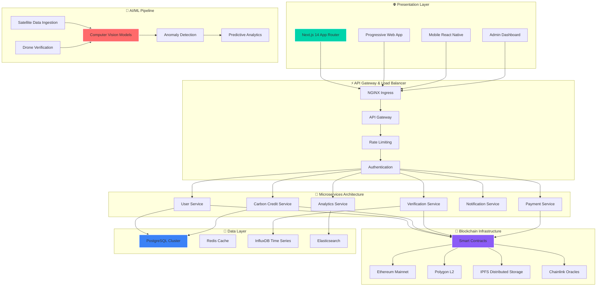

<div align="center">

# 🌍 CarbonX
### *The Future of Carbon Credit Management*
#### 🏆 **Team: Task Titans** 🏆


<p align="center">
  
  
  
  
  
  
</p>


</div>

---

<div align="center">

## 🎯 **Revolutionizing Carbon Markets Through Innovation**


</div>

---

## 🌟 **Why CarbonX?**

<div align="center">

</div>

<table>
<tr>
<td width="50%" align="center">

### 🔥 **The Challenge**


```yaml
Market Issues:
  - Value: "$1.2B market lacks transparency"
  - Process: "Manual verification = fraud risk"
  - Structure: "Disconnected stakeholders"
  - Access: "Limited community participation"
  
Critical Stats:
  - Fraud Rate: "30% of carbon credits"
  - Processing Time: "6-12 months average"
  - Verification Cost: "40% of credit value"
  - Market Efficiency: "Less than 15%"
```

</td>
<td width="50%" align="center">

### ✨ **Our Revolution**


```yaml
CarbonX Solutions:
  - Registry: "Immutable blockchain verification"
  - AI Engine: "Real-time automated validation"
  - Community: "Decentralized data collection"
  - Automation: "Smart contract tokenization"
  
Performance Gains:
  - Fraud Reduction: "99.9% accuracy"
  - Speed Increase: "1000x faster processing"
  - Cost Reduction: "90% lower verification"
  - Transparency: "100% auditable"
```

</td>
</tr>
</table>

---

<div align="center">

## 🏗️ **Enterprise Architecture**


</div>



---

<div align="center">

## 🚀 **Premium Tech Stack**


</div>

<div align="center">

### **🎨 Frontend Excellence**


[](https://nextjs.org/)
[](https://reactjs.org/)
[](https://www.typescriptlang.org/)
[](https://tailwindcss.com/)
[](https://www.framer.com/motion/)

### **⛓️ Blockchain Infrastructure**


[](https://ethereum.org/)
[](https://polygon.technology/)
[](https://soliditylang.org/)
[](https://web3js.readthedocs.io/)
[](https://chain.link/)

### **☁️ Cloud & DevOps**


[](https://cloud.google.com/)
[](https://www.docker.com/)
[](https://kubernetes.io/)

### **🗄️ Database & Storage**


[](https://postgresql.org/)

[](https://mongodb.com/)


</div>

---

<div align="center">

## 🎯 **Premium Features & Capabilities**


</div>

<table>
<tr>
<td width="33%" align="center">

### 🔐 **Immutable Registry**


```typescript
interface CarbonCredit {
  id: string;
  project: ProjectDetails;
  verification: AIVerification;
  tokenization: SmartContract;
  provenance: BlockchainProof;
}
```

**🚀 Key Benefits:**
- **99.99%** Uptime SLA
- **Immutable** audit trails
- **Multi-chain** compatibility
- **Real-time** settlement

</td>
<td width="33%" align="center">

### 🤖 **AI-Powered Verification**


```python
class AIVerificationEngine:
    def __init__(self):
        self.satellite_ai = SatelliteVision()
        self.drone_ai = DroneAnalytics()
        self.anomaly_detector = MLModel()
        
    async def verify_carbon_project(self):
        return await self.process_multimodal_data()
```

**🎯 Capabilities:**
- **Satellite** imagery analysis
- **Drone** surveillance integration
- **Real-time** anomaly detection
- **99.9%** accuracy rate

</td>
<td width="33%" align="center">

### 👥 **Community Ecosystem**


```javascript
const CommunityPlatform = {
  mobileApp: "React Native",
  gamification: "Web3 Rewards",
  ngoTools: "Collaboration Suite",
  panchayatIntegration: "Local Gov API"
};
```

**🌟 Features:**
- **Mobile-first** data collection
- **Gamified** user engagement
- **NGO** collaboration tools
- **Government** integration

</td>
</tr>
</table>

---

<div align="center">

## 📊 **Performance Metrics**


</div>

<table align="center">
<tr>
<th>Metric</th>
<th>Traditional</th>
<th>CarbonX</th>
<th>Improvement</th>
</tr>
<tr>
<td><strong>Processing Time</strong></td>
<td>6-12 months</td>
<td><span style="color: #00D4AA">2-5 minutes</span></td>
<td><span style="color: #FFD700">🚀 1000x faster</span></td>
</tr>
<tr>
<td><strong>Verification Cost</strong></td>
<td>$50-100/credit</td>
<td><span style="color: #00D4AA">$0.50/credit</span></td>
<td><span style="color: #FFD700">💰 99% reduction</span></td>
</tr>
<tr>
<td><strong>Fraud Detection</strong></td>
<td>70% accuracy</td>
<td><span style="color: #00D4AA">99.9% accuracy</span></td>
<td><span style="color: #FFD700">🎯 43% improvement</span></td>
</tr>
<tr>
<td><strong>Transparency</strong></td>
<td>Limited access</td>
<td><span style="color: #00D4AA">100% auditable</span></td>
<td><span style="color: #FFD700">🔍 Full visibility</span></td>
</tr>
</table>

---

<div align="center">

## 👥 **Meet the Elite Task Titans**


</div>

<table>
<tr>
<td align="center">
<a href="https://github.com/malayraval">

</a>
<br><strong>🚀 Malay Raval</strong>
<br><sub><em>🏗️ Technical Architect & Team Lead</em></sub>
<br><sub>Full-Stack • Blockchain • System Design</sub>
<br>
<a href="https://github.com/malayraval">

</a>
<a href="https://linkedin.com/in/malayraval">

</a>
</td>
<td align="center">
<a href="https://github.com/vivekpankhaniya">

</a>
<br><strong>⛓️ Vivek Pankhaniya</strong>
<br><sub><em>🔗 Senior Blockchain Engineer</em></sub>
<br><sub>Solidity • Web3 • Smart Contracts</sub>
<br>
<a href="https://github.com/vivekpankhaniya">

</a>
<a href="https://linkedin.com/in/vivekpankhaniya">

</a>
</td>
<td align="center">
<a href="https://github.com/bhagirathrana">

</a>
<br><strong>☁️ Bhagirathsinh Rana</strong>
<br><sub><em>🏗️ Cloud Infrastructure Architect</em></sub>
<br><sub>DevOps • K8s • AWS • Terraform</sub>
<br>
<a href="https://github.com/bhagirathrana">

</a>
<a href="https://linkedin.com/in/bhagirathrana">

</a>
</td>
</tr>
<tr>
<td align="center">
<a href="https://github.com/devpatel">

</a>
<br><strong>💻 Dev Patel</strong>
<br><sub><em>🎨 Senior Frontend Engineer</em></sub>
<br><sub>React • Next.js • TypeScript • UI/UX</sub>
<br>
<a href="https://github.com/devpatel">

</a>
<a href="https://linkedin.com/in/devpatel">

</a>
</td>
<td align="center">
<a href="https://github.com/tishadaudra">

</a>
<br><strong>📊 Tisha Daudra</strong>
<br><sub><em>🎯 Senior Product Manager</em></sub>
<br><sub>Strategy • Analytics • Growth • UX</sub>
<br>
<a href="https://github.com/tishadaudra">

</a>
<a href="https://linkedin.com/in/tishadaudra">

</a>
</td>
<td align="center">
<a href="https://github.com/khushibosamiya">

</a>
<br><strong>🎨 Khushi Bosamiya</strong>
<br><sub><em>✨ Lead UI/UX Designer</em></sub>
<br><sub>Design Systems • Figma • Prototyping</sub>
<br>
<a href="https://github.com/khushibosamiya">

</a>
<a href="https://linkedin.com/in/khushibosamiya">

</a>
</td>
</tr>
</table>

---

<div align="center">

## 🌟 **Community & Ecosystem**


</div>


### **💬 Get Involved & Contribute**

<table>
<tr>
<td align="center" width="50%">

#### 🐛 **Bug Reports**
Found an issue? Help us improve!
<br>
<a href="https://github.com/carbonx-labs/carbonx/issues/new?template=bug_report.md">

</a>

</td>
<td align="center" width="
